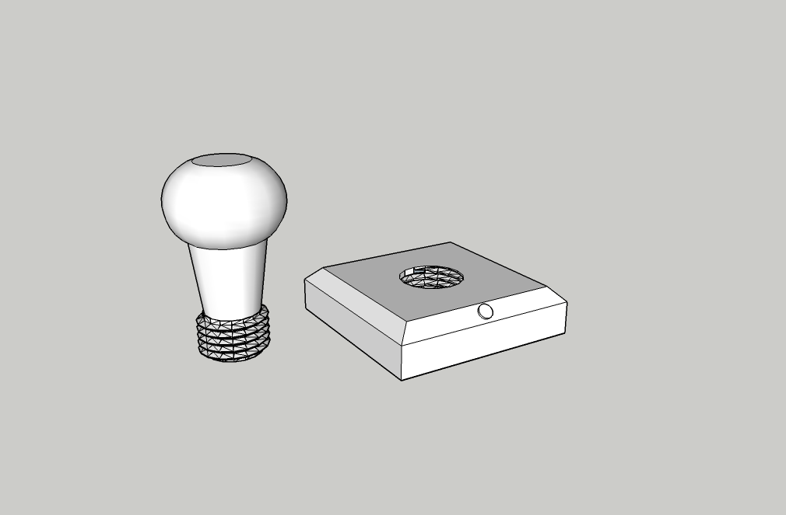

##  Stempel  ##
Ein Projekt aus dem erfindergarden.de. 40 x 40 mm Stempel mit aufschraubbarem Griff. Design mit Sketchup und Tinkercad

## Gewinde ##
Die Gewinde stammen aus dem online-Programm Tinkercad. Dort gibt es einen Gewindegenerator. 

Das Außengewinde habe ich aus diesem Generator übernommen und in Sketchup importiert.
Für das Innengewinde wurde das Außengewinde in der X und Y Achse auf das 1,2 fache vergrößert und mit der Volumenkörperfunktion aus dem Stempelunterteil ausgeschnitten.

